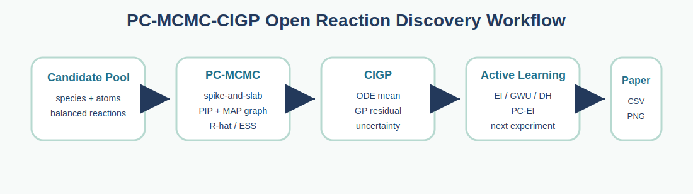

# PC-MCMC-CIGP


<p align="center">
  
</p>

<p align="center">
  
</p>

PC-MCMC-CIGP is a research-oriented Python package for interpretable reaction
network discovery and physics-informed active learning.

The project implements two core algorithmic modules from the paper draft
`Synergizing Physically Constrained MCMC and Chemical-Informed Gaussian Processes
for Reaction Network Discovery`:

1. **PC-MCMC**: spike-and-slab Bayesian topology search over candidate elementary
   reactions, with mass/charge conservation and detailed-balance style physical
   constraints.
2. **CIGP**: Chemical-Informed Gaussian Processes, where an ODE or kinetic
   physics model is embedded as the GP prior mean and a kernel models systematic
   residual error.

SINDy, PySR, and standard GP baselines are kept as examples or optional
benchmarks rather than core APIs.

## Installation

```bash
pip install -e .
```

For benchmark baselines:

```bash
pip install -e ".[benchmarks]"
```

For development:

```bash
pip install -e ".[dev,benchmarks]"
pytest
```

If your environment does not have `pytest`, run the built-in smoke runner:

```bash
python scripts/run_smoke_tests.py
```

## Quick Start

```python
import numpy as np

from pc_mcmc_cigp.discovery import MCMCConfig, MechanismEngine, SpikeAndSlabSampler
from pc_mcmc_cigp.reactions import Reaction, Species

a = Species("A", {"A": 1})
b = Species("B", {"B": 1})
engine = MechanismEngine([a, b], [Reaction([a], [b])])

t = np.linspace(0, 1, 8)
y0 = np.array([1.0, 0.0])
data = engine.simulate(np.array([1.0]), np.array([1.0]), y0, t)
dataset = [{"t": t, "y0_full": y0, "data_matrix": data, "obs_indices": [0, 1]}]

result = SpikeAndSlabSampler(
    engine,
    MCMCConfig(n_steps=200, burn_in=50, enable_thermo_constraints=False, random_state=0),
).fit(dataset)

print(result.posterior_inclusion_probabilities)
print([r.equation_str for r in result.selected_reactions])
```

## Package Layout

- `pc_mcmc_cigp.reactions`: species, reaction, and atom-balanced network generation.
- `pc_mcmc_cigp.discovery`: mass-action ODE engine and spike-and-slab sampler.
- `pc_mcmc_cigp.cigp`: sklearn-style CIGP regressor.
- `pc_mcmc_cigp.acquisition`: EI, GWU, discrepancy hunter, and physically constrained EI.
- `pc_mcmc_cigp.benchmarks`: HBr mechanism discovery and styrene epoxidation examples.
- `pc_mcmc_cigp.kinetics`: reusable kinetic priors and rate laws shared by CIGP and PC-MCMC.

## Kinetic template library

The public template registry covers elementary Arrhenius, series, parallel,
reversible, autocatalytic, epoxidation, Robertson, Michaelis--Menten,
Langmuir--Hinshelwood, generalized power-law, inhibited/saturating, and radical
chain kinetics. Templates use physical inputs and expose parameter names, bounds,
units, full final-state diagnostics, and finite-difference sensitivities:

```python
from pc_mcmc_cigp.kinetics import TemplateRegistry, create_kinetic_template

print(TemplateRegistry.names())
physics = create_kinetic_template("reversible_arrhenius")
print(TemplateRegistry.describe("reversible_arrhenius"))
```

Organic mechanisms should be represented by composing elementary reaction steps
and rate laws instead of adding a hard-coded class per named reaction. Supported
PC-MCMC laws include `MassActionRate`, `PowerLawRate`, `ArrheniusRate`,
`ReversibleRate`, and `SaturationRate`. `PathwayGenerator` enumerates bounded
source-to-product routes and the sampler accepts those routes as group proposals.

Run `python examples/kinetic_template_gallery.py` for representative CIGP fits.

## Agent-ready deterministic backend

`pc_mcmc_cigp.agent_backend` provides the API-independent foundation for a
future natural-language reaction agent: project state, experiment requests,
CSV validation, mechanism compilation, approval-gated PC-MCMC, CIGP template
screening, versioned artifacts, audit events, and frontend JSON read models.

No OpenAI API key is required. Run:

```bash
python examples/agent_backend_workflow.py
```

See `docs/AGENT_BACKEND_ZH.md` for the workflow and explicit unfinished items.

Start the local visual workbench without an API key or web-framework install:

```bash
python scripts/run_agent_web.py
```

Then open `http://127.0.0.1:8765`. The browser communicates only with the local
project store and deterministic algorithm services; OpenAI integration remains disabled.

For an optional OpenAI-compatible LLM provider, set `OPENAI_API_KEY`,
`OPENAI_BASE_URL`, and `OPENAI_MODEL` in the server process. Validate the
provider first with `python scripts/probe_llm_api.py`; credentials are never
accepted as command-line arguments or written by the application.
- `examples/`: runnable scripts for paper-style experiments and baselines.

Chinese documentation:

- `docs/USAGE_ZH.md`
- `docs/API_ZH.md`
- `docs/PAPER_JOURNAL_STRATEGY_ZH.md`

## Reproducing the Main Examples

```bash
python examples/discover_hbr_mechanism.py
python examples/optimize_epoxidation_cigp.py
python examples/baselines/sindy_hbr.py
```

The first two scripts use the package APIs directly. The SINDy script is a
baseline and requires the optional `pysindy` dependency.

For paper-style machine-readable outputs:

```bash
python experiments/fig3_hbr_discovery.py
python experiments/fig4_epoxidation_bo.py
python scripts/plot_fig3.py
python scripts/plot_fig4.py
```

These write JSON/CSV outputs under `examples/outputs/`. Generated outputs are
ignored by git; keep the scripts as the source of truth.

Original exploratory scripts are preserved in `legacy/` for reference. New code
should use the package API under `pc_mcmc_cigp/`.

To regenerate the Fig.4 comparison from the source PowerPoint data:

```bash
python scripts/extract_ppt_optimization_logs.py "D:/工作二连续流/图/图改.pptx" data
python scripts/plot_fig4.py
```
